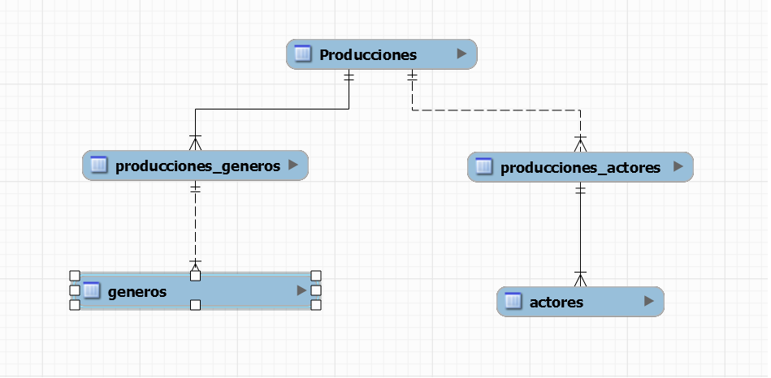
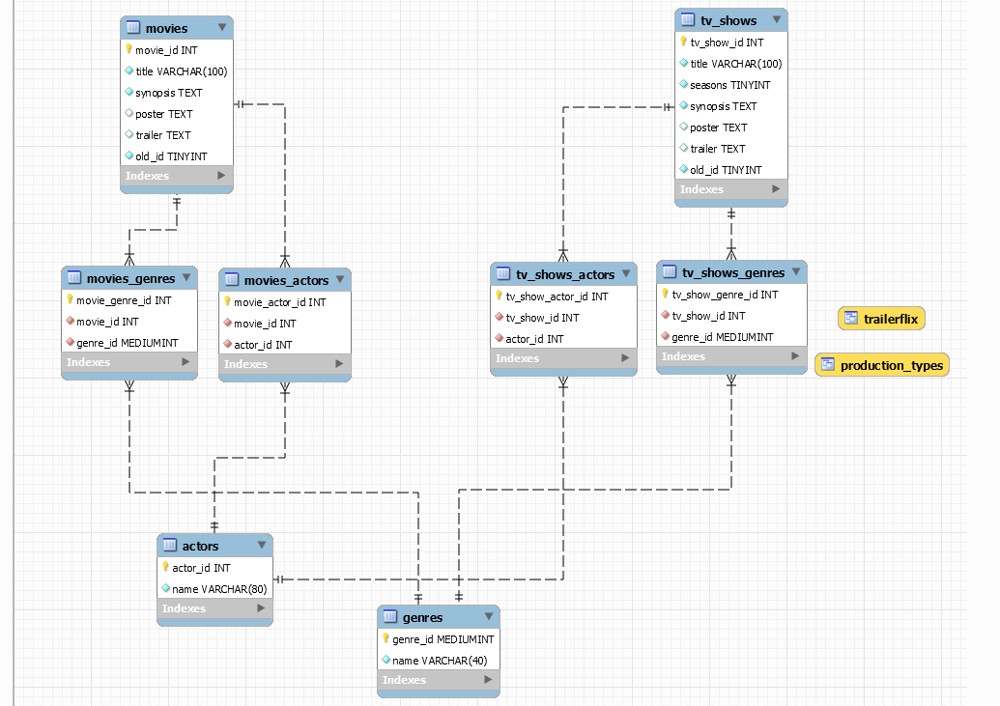

# Tercer proyecto integrador: API-RESTFUL con NodeJS, Express, MySQL y Sequelize

#### Índice
- [Introducción](#introducción)
- [Inicialización del programa](#inicialización-del-programa)
- [Migración de modelo NoSQL a SQL](#migración-de-modelo-nosql-a-sql)
  - [Edición el archivo **trailerflix.json**](#edición-el-archivo-trailerflixjson)
  - [Desarrollo del modelo SQL](#desarrollo-del-modelo-sql)
  - [Extracción de la información](#extracción-de-la-información)
- [Modelos de Sequelize](#modelos-de-sequelize)
- [Rutas](#rutas)
  - [Obtener película por nombre](#obtener-película-por-nombre)
  - [Obtener serie por nombre](#obtener-serie-por-nombre)
  - [Obtener películas por género](#obtener-películas-por-género)
  - [Obtener series por género](#obtener-series-por-género)
  - [Obtener producciones por nombre de actor](#obtener-producciones-por-nombre-de-actor)
  - [Obtener categorías](#obtener-categorías)
  - [Obtener todas las producciones](#obtener-todas-las-producciones)
  - [Obtener producción por ID](#obtener-producción-por-id)
  - [Obtener producciones por nombre](#obtener-producciones-por-nombre)
  - [Obtener producciones por género](#obtener-producciones-por-género)
  - [Obtener producciones por categoría](#obtener-producciones-por-categoría)


## Introducción

Este informe es parte de la resolución del tercer proyecto integrador del curso de Backend dictado por la UNTREF para el plan Argentina Programa 4.0.

## Inicialización del programa

El único requisito para utilizar el programa en local es tener el servidor de MySQL y el entorno NodeJS instalado. Al iniciar el programa por primera vez, este se encarga de crear la base de datos, las tablas y cargarla con la información.

## Migración de modelo NoSQL a SQL

El primer requerimiento del proyecto era migrar un modelo NoSQL de una base de datos llamada "trailerflix", y convertirla en uno SQL. Los archivos se encuentran en **./database-design-files**. A continuación se explican los pasos para llevar a cabo esta tarea.   

### Edición el archivo **trailerflix.json**

El archivo **trailerflix.json**  tenía algunos errores:

1.  Las producciones tenían el género **Ciencia Ficción** y **Sci-fi** como si fueran géneros distintos. Todas las apariciones de **Sci-fi** fueron cambiadas por **Ciencia Ficción**.
2. Corrección de Typos: **Hechos Veríficos** (con f) y también **¿Ficción?** (con signos de preguntas).
3. Finalmente el archivo utilizado en el proyecto fue renombrado a **edited-trailerflix.json**.

### Desarrollo del modelo SQL

Estos fueron los pasos seguidos para el desarrollo del modelo SQL:

1. Se observó que en los objetos JSON había varios campos multivalor
como lo son **géneros** y **reparto**, decidí que estos eran candidatos para ser entidades.



2. Después noté que agrupar todas las producciones en una sola tabla no era lo más conveniente porque:

    1. El campo **categoría** repetía información.
    2. Las películas no tienen **temporadas** por lo que había que rellenar los campos con **NULL**.
    3. En el caso de agregar otro tipo de producción como por ejemplo: documental, cortometraje u otro, todas la información estaría en una sola tabla.
    
3. Decidí considerar cada tipo de producción como una entidad y como consecuencia cada tabla tendría menos registros. Ahora por cada tipo de producción tenía que conectarla con dos tablas intermedias para luego conectarlas con los géneros y con los actores.

4. Se agregaron dos vistas:
    1. **trailerflix**: Muestra los datos de la misma manera a como se muestran en el archivo **edited-trailerflix.json**
    2. **production-types**: Muestra los tipos de producciones, es decir, las tablas que tienen el campo **title**.



### Extracción de la información 

Para extraer la información utilicé **chat-GPT** en primer lugar pero este no me dio los resultados que esperaba así que opté por hacerlo con un programa javascript. Como resultado de ejecutar el archivo **extract-data-from-trailerflix.js**,
se obtienen una serie de archivos JSON que luego serán utilizados por el programa principal para llenar la base de datos.


Un snippet de **extract-data-from-trailerflix.js**
```javaScript
const createActorsFile = productions => {
	try {
		const actorList = [];
		let counter = 1;
		for(let prod of productions) {
			let actorsInTheProduction = prod.reparto.split(/, /g)
			for(let actor of actorsInTheProduction) {
				let actorID = {actor_id: counter, name: actor.trim()}
				if(!actorList.find(actor => actor.name === actorID.name)) {
					actorList.push(actorID);
					counter++
				}
					
			}
		}
		const jsonData = JSON.stringify(actorList, null, 2);
		const fileDescriptor = fs.openSync('actors.json', 'w');
        const fileContent = fs.writeFileSync(fileDescriptor, jsonData);
		fs.closeSync(fileDescriptor);
	} catch(error) {
		console.log(error);
	}
}

```

## Modelos de Sequelize

Otro de los requerimientos del proyecto era utilizar la librería **Sequelize** para evitar (en lo posible) el uso del lenguaje SQL para realizar consultas a la base de datos. Esta librería tiene como concepto principal **los modelos** que son objetos javascript que representan las tablas de la base de datos. 

Todos los modelos, definición e inicialización se encuentran en el archivo ***./src/models/models.js***.

*Snippet de un modelo*
```js
const Actor = sequelize.define('Actor', {
  actor_id: {
    type: DataTypes.INTEGER.UNSIGNED,
    primaryKey: true,
    autoIncrement: true
  },
  name: {
    type: DataTypes.STRING(80),
    allowNull: false
  }
}, {
  tableName: 'actors',
  timestamps: false
});
```
## Rutas

Conviene tener el programa ejecutándose para ir viendo los ejemplos mientras se lee esta guía. 

Notar que las producciones se encuentran ordenadas según el **id** que tenía el archivo **trailerflix**. En la base de datos se corresponde con la columna **old_id**.

| URL                                                       | Descripción                                      |
| --------------------------------------------------------- | ------------------------------------------------- |
| `/api/obtener/catalogo/pelicula/nombre/:nombre`           | [Obtener película por nombre](#obtener-película-por-nombre)               |
| `/api/obtener/catalogo/serie/nombre/:nombre`              | [Obtener serie por nombre](#obtener-serie-por-nombre)                      |
| `/api/obtener/catalogo/pelicula/genero/:genero`           | [Obtener películas por género](#obtener-películas-por-género)               |
| `/api/obtener/catalogo/serie/genero/:genero`              | [Obtener series por género](#obtener-series-por-género)                    |
| `/api/obtener/producciones/del/actor/:nombre`             | [Obtener producciones por nombre de actor](#obtener-producciones-por-nombre-de-actor)        |
| `/api/obtener/categorias`                                 | [Obtener categorías](#obtener-categorías)                                       |
| `/api/obtener/catalogo`                                   | [Obtener todas las producciones](#obtener-todas-las-producciones)                    |
| `/api/obtener/catalogo/id/:id`                            | [Obtener producción por ID](#obtener-producción-por-id)                      |
| `/api/obtener/catalogo/nombre/:nombre`                    | [Obtener producciones por nombre](#obtener-producciones-por-nombre)                  |
| `/api/obtener/catalogo/genero/:genero`                    | [Obtener producciones por género](#obtener-producciones-por-género)                  |
| `/api/obtener/catalogo/categoria/:categoria`              | [Obtener producciones por categoría](#obtener-producciones-por-categoría)              |


### Obtener película por nombre

> [http://localhost:3008/api/obtener/catalogo/pelicula/nombre/the](http://localhost:3008/api/obtener/catalogo/pelicula/nombre/the)

Un ejemplo en donde no hay coincidencias:
> [http://localhost:3008/api/obtener/catalogo/pelicula/nombre/zzz](http://localhost:3008/api/obtener/catalogo/pelicula/nombre/zzz) 

### Obtener serie por nombre

> [http://localhost:3008/api/obtener/catalogo/serie/nombre/ca](http://localhost:3008/api/obtener/catalogo/serie/nombre/ca)

Ejemplo en donde no hay coincidencias:
> [http://localhost:3008/api/obtener/catalogo/serie/nombre/jy](http://localhost:3008/api/obtener/catalogo/serie/nombre/jy)

### Obtener películas por género

> [http://localhost:3008/api/obtener/catalogo/pelicula/genero/Misterio](http://localhost:3008/api/obtener/catalogo/pelicula/genero/Misterio)

Ejemplo en el que no hay coincidencias
> [http://localhost:3008/api/obtener/catalogo/pelicula/genero/animacion](http://localhost:3008/api/obtener/catalogo/pelicula/genero/animacion)

### Obtener series por género

> [http://localhost:3008/api/obtener/catalogo/serie/genero/drama](http://localhost:3008/api/obtener/catalogo/serie/genero/drama)

Ejemplo en el que no hay coincidencias:
> [http://localhost:3008/api/obtener/catalogo/serie/genero/historica](http://localhost:3008/api/obtener/catalogo/serie/genero/historica)

### Obtener producciones por nombre de actor

> [http://localhost:3008/api/obtener/producciones/del/actor/Anya Taylor-Joy](http://localhost:3008/api/obtener/producciones/del/actor/Anya%20Taylor-Joy)

Ejemplo en el que no hay coincidencias
> [http://localhost:3008/api/obtener/producciones/del/actor/Guillermo Larroca](http://localhost:3008/api/obtener/producciones/del/actor/Guillermo%20Larroca) xD

### Obtener categorías

> [http://localhost:3008/api/obtener/categorias](http://localhost:3008/api/obtener/categorias)

### Obtener todas las producciones

> [http://localhost:3008/api/obtener/catalogo](http://localhost:3008/api/obtener/catalogo)

### Obtener producción por ID

> [http://localhost:3008/api/obtener/catalogo/id/22](http://localhost:3008/api/obtener/catalogo/id/22)

Ejemplo en el que no hay coincidencias
> [http://localhost:3008/api/obtener/catalogo/id/100](http://localhost:3008/api/obtener/catalogo/id/100)

En el caso de que en la ruta se ingrese un número no positivo o palabras se tiene un mensaje de error.

> [http://localhost:3008/api/obtener/catalogo/id/0](http://localhost:3008/api/obtener/catalogo/id/0)

> [http://localhost:3008/api/obtener/catalogo/id/-1000](http://localhost:3008/api/obtener/catalogo/id/-1000)

> [http://localhost:3008/api/obtener/catalogo/id/holaMundo](http://localhost:3008/api/obtener/catalogo/id/holaMundo)

### Obtener producciones por nombre

> [http://localhost:3008/api/obtener/catalogo/nombre/the](http://localhost:3008/api/obtener/catalogo/nombre/the)

Ejemplo en el que no hay coincidencias
> [http://localhost:3008/api/obtener/catalogo/nombre/zz](http://localhost:3008/api/obtener/catalogo/nombre/zz)

### Obtener producciones por género

> [http://localhost:3008/api/obtener/catalogo/genero/Hechos verídicos](http://localhost:3008/api/obtener/catalogo/genero/Hechos%20verídicos)

Ejemplo en el que no hay coincidencias:
> [http://localhost:3008/api/obtener/catalogo/genero/belica](http://localhost:3008/api/obtener/catalogo/genero/belica)

### Obtener producciones por categoría

> [http://localhost:3008/api/obtener/catalogo/categoria/serie](http://localhost:3008/api/obtener/catalogo/categoria/serie)

Ejemplo en el que no hay coincidencias:
> [http://localhost:3008/api/obtener/catalogo/categoria/cursos](http://localhost:3008/api/obtener/catalogo/categoria/cursos)

## Consideraciones finales

La realización de este proyecto me permitió conocer MySQL, la librería Sequelize  y como integrar ambas tecnologías, como así también entender como migrar un modelo no relacional a uno relacional.

Se cumplieron los requerimientos solicitados, y dado lo interesante del proyecto, planeo continuarlo. Los siguientes pasos son: agregar los métodos PUT, PATCH, POST, y DELETE para terminar el CRUD y agregar una capa front-end. Luego pretendo incluirlo en mi portafolio.

Por último, quería darles las gracias a los docentes Jean Larez, Mateo Catalano y Gerardo Burgos por la guía durante el curso.

Hasta la próxima.

 


  


